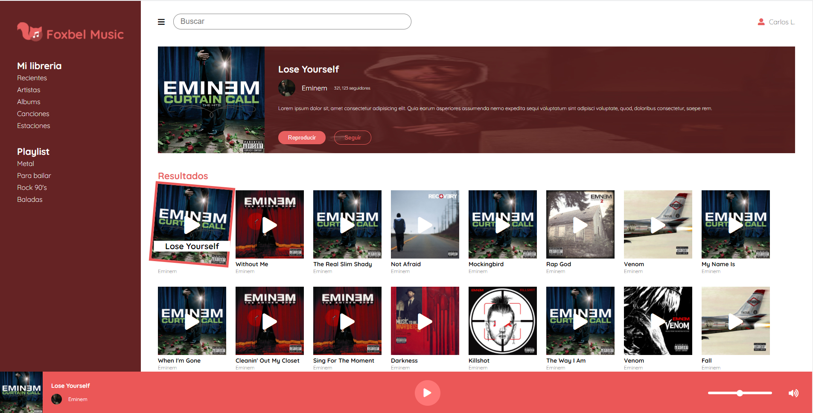
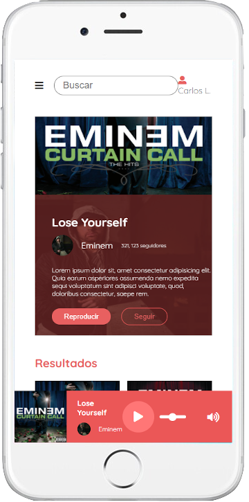
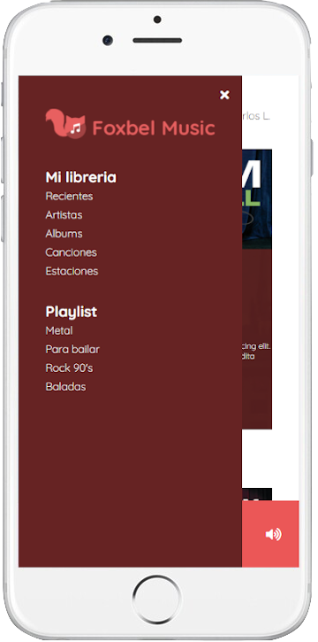

# Foxbel Music App
This project was proposed by FractalUp as a challenge to show skills on Vuejs.

- Vue
- Vuex
- CSS & SCSS
- Deezer API
## Screenshots
### Desktop

### Mobile




## Project setup
```
npm install
```

### Compiles and hot-reloads for development
```
npm run serve
```

### Compiles and minifies for production
```
npm run build
```

### Lints and fixes files
```
npm run lint
```